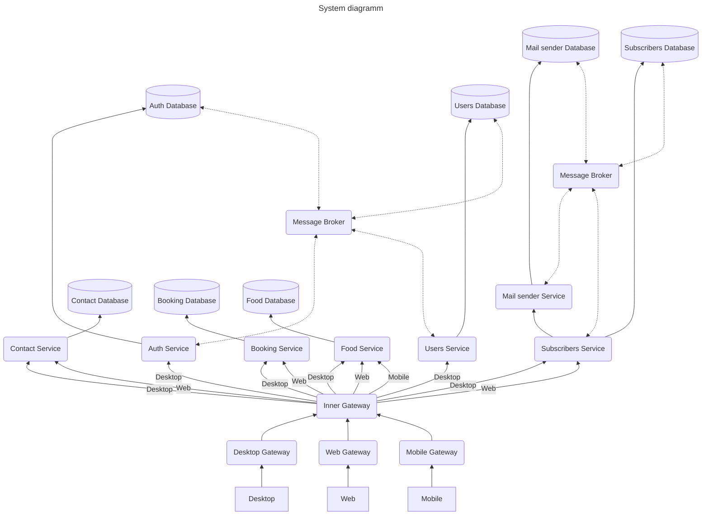

```mermaid

---
title: System diagramm
---
flowchart BT

Desktop --> DesktopGateway(Desktop Gateway) --> InnerGateway(Inner Gateway)

InnerGateway(Inner Gateway) -- Desktop --> AuthService(Auth Service)

InnerGateway(Inner Gateway) -- Desktop --> UsersService(Users Service)

InnerGateway(Inner Gateway) -- Desktop --> ContactService(Contact Service)

InnerGateway(Inner Gateway) -- Desktop --> FoodService(Food Service)

InnerGateway(Inner Gateway) -- Desktop --> BookingService(Booking Service)

InnerGateway(Inner Gateway) -- Desktop --> SubscribersService(Subscribers Service)


Web --> WebGateway(Web Gateway) --> InnerGateway(Inner Gateway)

InnerGateway(Inner Gateway) -- Web --> ContactService(Contact Service)

InnerGateway(Inner Gateway) -- Web --> FoodService(Food Service)

InnerGateway(Inner Gateway) -- Web --> BookingService(Booking Service)

InnerGateway(Inner Gateway) -- Web --> SubscribersService(Subscribers Service)


Mobile --> MobileGateway(Mobile Gateway) --> InnerGateway(Inner Gateway)

InnerGateway(Inner Gateway) -- Mobile --> FoodService(Food Service)

SubscribersService --> MailSenderService(Mail sender Service)

AuthService --> AuthDb[(Auth Database)]

UsersService --> UsersDb[(Users Database)]

AuthService <-...-> MessageBroker(Message Broker)
MessageBroker(Message Broker) <-...-> AuthDb[(Auth Database)]

UsersService <-...-> MessageBroker(Message Broker)
MessageBroker(Message Broker) <-...-> UsersDb[(Users Database)]

ContactService --> ContactDb[(Contact Database)]

BookingService --> BookingDb[(Booking Database)]

SubscribersService --> SubscribersDb[(Subscribers Database)]

MailSenderService --> MailSenderDb[(Mail sender Database)]

FoodService --> FoodDb[(Food Database)]

MailSenderService <-...-> MessageBroker2(Message Broker)
MessageBroker2(Message Broker) <-...-> MailSenderDb[(Mail sender Database)]

SubscribersService <-...-> MessageBroker2(Message Broker)
MessageBroker2(Message Broker) <-...-> SubscribersDb[(Subscribers Database)]

```
